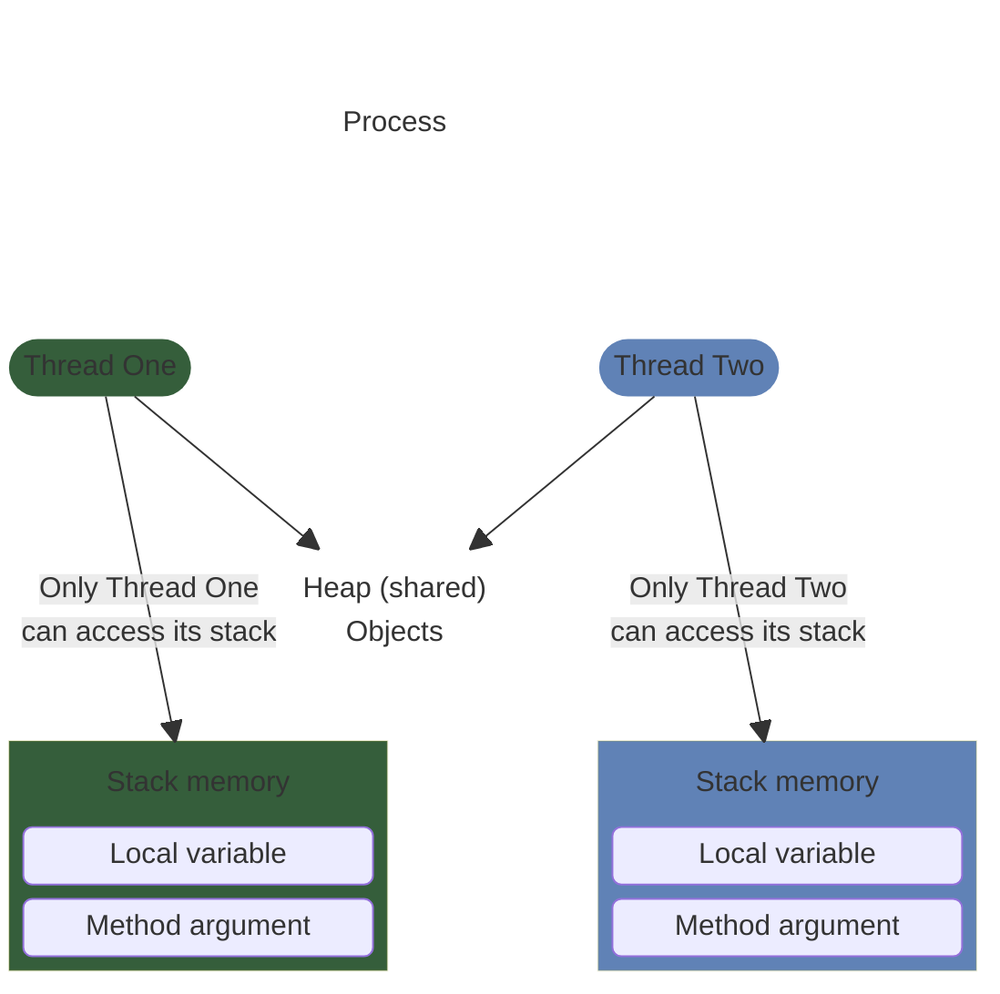
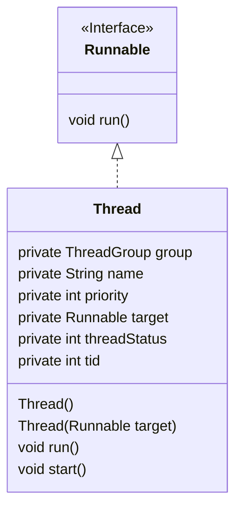
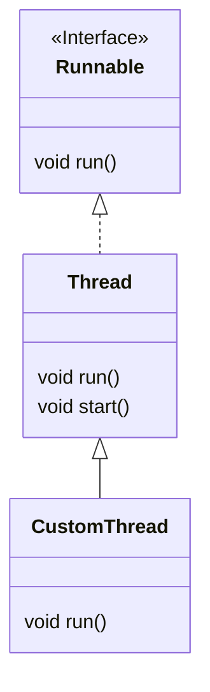
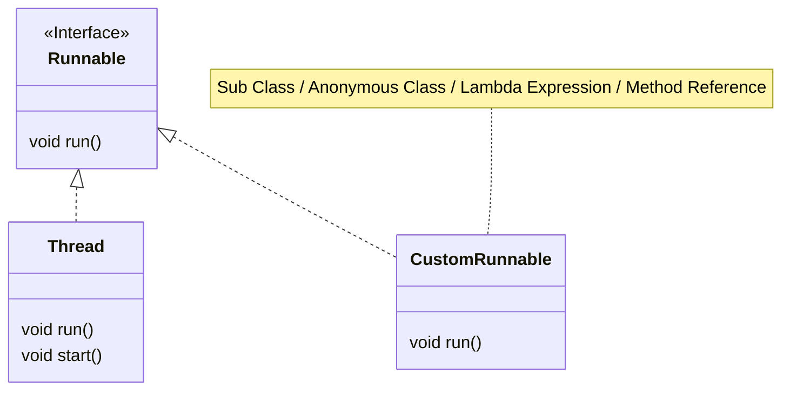
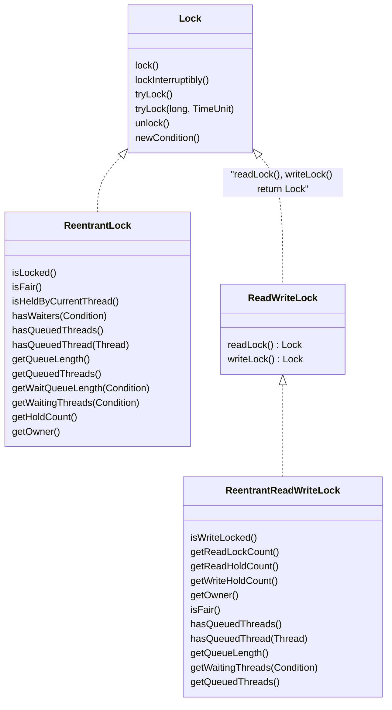
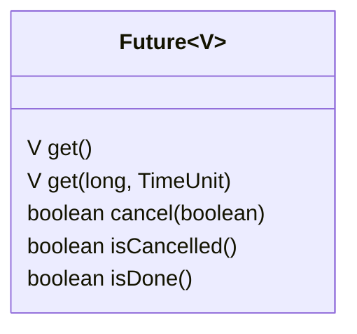

# Concurrency

## Basics

Process is a unit of execution, that has its own memory space - heap. The heap isn't shared between
two applications or two processes, they each have their own. Each process can have multiple threads.
Every application has at least one thread, and that's the main thread.

- Creating a thread doesn't require as many resources as creating a process does
- Every thread created by a process, shares that process's memory space, the heap
- Each thread's got what's called a thread stack. This is memory, that only a single thread, will
  have access to

Every Java application runs as a single process, and each process can then have multiple threads
within it. Every process has a heap, and every thread has a thread stack.

### Threads accessing memory

Each thread has its own stack for local variables and method calls. One thread doesn't have access
to another thread's stack. Every concurrent thread additionally has access to the process memory, or
the heap. This is where objects and their data reside. This shared memory space allows all threads,
to read and modify the same objects. When one thread changes an object on the heap, these changes
are visible to other threads.



### Time Slicing

It's a technique used in multitasking operating systems, to allow multiple threads or processes to
share a single CPU for execution. Available CPU time is sliced into small-time intervals, which are
divvied out to the threads. Each thread gets that interval, to attempt to make some progress, on the
tasks it has to do. Whether it completes its task or not, in that time slice, doesn't matter to the
thread management system. When the time is up, it has to yield to another thread, and wait until its
turn again.

### Interference

A thread can be halfway through its work, when it's time slice expires, and it then has to pause or
suspend execution, to allow other threads to wake up and execute. This means another active thread
has an open door, to that same unit of work, where the paused thread is only partially done.

### Interleaving

- When multiple threads run concurrently, their instructions can overlap or _interleave_ in time
- The execution of multiple threads happens in an arbitrary order
- The order in which the threads execute can't be guaranteed

### Atomic actions

An atomic action is one, that effectively happens all at once. It either happens completely, or it
doesn't happen at all. Side effects of an atomic action *are never visible until the action
completes*.

Even some assignment operators like for longs and doubles are not atomic. Some other examples are

`i++` - increment operand

`--i` - decrement operand

### Thread-Safe

An object or a block of code is thread safe, if the correctness and consistency of the program's
output or its visible state, is unaffected by other threads. Atomic operations and immutable objects
are examples of thread-safe code.

### [JMM](https://docs.oracle.com/javase/specs/jls/se7/html/jls-17.html#jls-17.4)

The Java Memory Model, is a specification that defines some rules and behaviors for threads, to help
control and manage shared access to data, and operations.

- Atomicity of Operations. Few operations are truly atomic.
- Synchronization is the process of controlling threads' access to shared resources.

## Java's Threads

### `java.util.Thread`



#### Priority

Thread priority is a value from 1 to 10. The Thread class has three pre-defined priorities

- `Thread.MIN_PRIORITY = 1` - low
- `Thread.MIN_PRIORITY = 5` - default
- `Thread.MIN_PRIORITY = 10` - high

Higher-priority threads have a better chance of being scheduled, by a thread scheduler, over the
lower-priority threads. We can think of the priority as more of a suggestion, to the thread
management process.

### Ways to create a thread

- Extend the `Thread` class, and create an instance of this new subclass
- Create a new instance of `Thread`, and pass it any instance that implements the `Runnable`
  interface
- Use an `Executor`, to create one or more threads

#### Extending the `Thread` class



Then we can do something like

```java
new CustomThread().start();
```

Advantages of extending a thread are

- We have more control over the thread's behavior and properties
- We can access the thread's methods and fields directly from our subclass
- We can create a new thread for each task

Disadvantages

- We can only extend one class in Java, so our subclass can't extend any other classes
- Our class is tightly coupled to the `Thread` class, which may make it difficult to maintain

#### Implementing `Runnable`



Then we can do something like

```java
new Thread(CustomRunnable).start();
```

Advantages of implementing a `Runnable`

- We can extend any class and still implement `Runnable`
- Our class (if we create a class) is loosely coupled to the `Thread` class, which makes it easier
  to maintain
- We can use anonymous classes, lambda expressions, or method references, to very quickly describe
  thread behavior

Disadvantages

- We do have less control over the thread's behavior and properties

### `run()` and `start()`

There's a big difference between calling `run()` and `start()`.

:::important
If we execute the `run()` method, it's executed _synchronously_, by the running thread it's invoked
from. If we want our code to be run _asynchronously_, we must call the `native start()` method.
:::

### States

| Status          | Meaning                                                                                                              |
|-----------------|----------------------------------------------------------------------------------------------------------------------|
| `NEW`           | A thread that has not yet started is in this state                                                                   |
| `RUNNABLE`      | A thread executing in the Java virtual machine is in this state                                                      |
| `BLOCKED`       | A thread that is blocked waiting for a monitor lock is in this state                                                 |
| `WAITING`       | A thread that is waiting indefinitely for another thread to perform a particular action is in this state             |
| `TIMED_WAITING` | A thread that is waiting for another thread to perform an action for up to a specified waiting time is in this state |
| `TERMINATED`    | A thread that has exited is in this state                                                                            |

## `volatile`

The operating system may read from heap variables, and make a copy of the value, in each thread's
own storage cache. Each thread has its own small and fast memory storage, that holds its own copy of
a shared resource's value. One thread can modify a shared variable, but this change might not be
immediately reflected or visible. Instead, it's first updated in the thread's local cache. The
operating system may not flush the first thread's changes to the heap, until the thread has finished
executing.

The `volatile` keyword is used as a modifier for class variables. It's an indicator that this
variable's value may be changed by multiple threads. This modifier ensures that the variable is
always read from, and written to the main memory, rather than from any thread-specific caches. This
provides memory consistency for this variable's value across threads.

### When to use

- When a variable is used to track the state of a shared resource, such as a counter or a flag
- When a variable is used to communicate between threads

### When not to use

- When a variable is only used by a single thread 
- When a variable is used to store a large amount of data

## `synchronized`

Different invocations of `synchronized` methods, on the same object, are guaranteed not to
interleave. When one thread is executing a `synchronized` method for an object, all other threads
that invoke `synchronized` methods for the same object, block, and suspend their execution, until
the first thread is done with the object. When a `synchronized` method exits, it ensures that the
state of the object is visible to all threads.

```java
public synchronized void instanceMethod() {
    // Locks on 'this'
}

public static synchronized void staticMethod() {
    // Locks on Class object (MyClass.class)
}
```

### Critical Section

The critical section is the code that's referencing a shared resource like a variable. Only one
thread at a time should be able to execute a critical section. When all critical sections are
synchronized, the class is thread-safe.

### Object instance monitor

Every object instance in Java has a space for a built-in intrinsic lock, also known as a monitor
lock. A thread acquires a lock by executing a synchronized method on the instance, or by using the
instance as the parameter to a synchronized statement. A thread releases a lock when it exits from a
synchronized block or method, even if it throws an exception. Only one thread at a time can acquire
this lock, which prevents all other threads from accessing the instance's state, until the lock is
released. All other threads, which want access to the instance's state through synchronized code,
will block, and wait, until they can acquire a lock.

### Statement

The synchronized statement is usually a better option in most circumstances, since it limits the
scope of synchronization, to the critical section of code. It gives us much more granular control,
over when we want other threads to block.

```java
public void doSomething() {
    synchronized(this) {
        // Critical section — only one thread at a time per instance
    }

    synchronized(SomeClass.class) {
        // Critical section — one thread across all instances
    }

    synchronized(someOtherObject) {
        // We can lock on any object we choose
    }
}
```

Using synchronized statement on specific object or a class property lets other threads work faster
with the instance, the statement is located in. This is because we are not locking the whole object
which might be a singleton service, but only the data that must stay synced or.

### Reentrant Synchronization

When method calls are executed from the same thread, any nested calls which try to acquire
the lock, won't block, because the current thread already has it. Without this, threads could block
indefinitely.

### [`wait()`](https://docs.oracle.com/javase/8/docs/api/java/lang/Object.html#wait-long-), [`notify()`](https://docs.oracle.com/javase/8/docs/api/java/lang/Object.html#notify--), [`notifyAll()`](https://docs.oracle.com/javase/8/docs/api/java/lang/Object.html#notifyAll--)

Are used to manage some monitor lock situations, to prevent threads from blocking indefinitely.
Because these methods are on `Object`, any instance of any class, can execute these methods, from
within a `synchronized` method or statement.

There are a few pieces of docs that are important here

1. A _spurious wakeup_ might happen, so a thread might wake up without being notified, interrupted,
   or timing out, so `wait()` must be used in a loop of some kind like

```java
synchronized (obj) {
         while (<condition does not hold>)
             obj.wait(timeout);
         ... // Perform action appropriate to condition
     }
```

2. There are three ways of a thread becoming the owner of the object's monitor

- By executing a `synchronized` instance method of that object
- By executing the body of a `synchronized` statement that synchronizes on the object
- For objects of type Class, by executing a `synchronized` static method of that class

## Locks

The purpose of a lock is to control access to a shared resource by multiple threads. The monitor
lock is pretty easy to use, but it does have limitations.

- There's no way to test if the intrinsic lock has already been acquired
- There's no way to interrupt a blocked thread
- There's not an easy way to debug, or examine the intrinsic lock
- The intrinsic lock is an exclusive lock

### `java.util.concurrent.locks`

The [
`Lock`](https://docs.oracle.com/en/java/javase/17/docs/api/java.base/java/util/concurrent/locks/Lock.html)
Interface, and some of the provided implementations, can give us a bit more control, and
flexibility over locking, and when and how to block threads.

The hold count of a lock counts the number of times that a single thread, the owner of the lock, has
acquired the lock.

1. When a thread acquires a lock for the first time, the lock's hold count is set to one
2. If a lock is re-entrant, and a thread, reacquires the same lock, the lock's hold count will get
   incremented
3. When a thread releases a lock, the lock's hold count is decremented
4. A lock is only released when it's hold count becomes zero

Because of this, it's really important to include a call to the unlock method in a `finally` clause,
of any code that will acquire a lock, even if it's re-entrant.

Advantages of using `Lock` implementations

- Explicit control over when to acquire and release locks, making it easier to avoid deadlocks, and
  manage other concurrency challenges
- Timeouts allow us to attempt to acquire a lock without blocking indefinitely
- Along with timeouts, Interruptible Locking lets us handle interruptions during acquisition more
  gracefully
- Improved Debugging methods let us query the number of waiting threads, and check if a thread
  holds a lock



#### [`ReentrantLock`](https://docs.oracle.com/en/java/javase/17/docs/api/java.base/java/util/concurrent/locks/ReentrantLock.html)

- Explicit locking (`lock()` and `unlock()`)
- Reentrancy: same thread can lock multiple times
- `tryLock()`: non-blocking attempt to acquire a lock
- `lockInterruptibly()`: allows interruption
- Fairness is possible: queue threads in order of arrival

```java
new ReentrantLock(true);
```

#### [`ReentrantReadWriteLock`](https://docs.oracle.com/en/java/javase/17/docs/api/java.base/java/util/concurrent/locks/ReentrantReadWriteLock.html)

`ReentrantReadWriteLock`s can be used to improve concurrency in some uses of some kinds of
`Collection`s. This is typically worthwhile only when the collections are expected to be large,
accessed by more reader threads than writer threads, and entail operations with overhead that
outweighs synchronization overhead.

- Multiple readers at the same time
- Only one writer, and no readers during writing

```java
ReadWriteLock rwLock = new ReentrantReadWriteLock();
Lock readLock = rwLock.readLock();
Lock writeLock = rwLock.writeLock();
```

## [`ExecutorService`](https://docs.oracle.com/en/java/javase/17/docs/api/java.base/java/util/concurrent/ExecutorService.html)

`ExecutorService` classes exist to manage the creation and execution of threads. Managing threads
manually can be complex and error-prone. It can lead to complex issues like resource contention,
thread creation overhead, and scalability challenges. For these reasons, we'll want to use an
`ExecutorService`, even when working with a single thread.

Java provides several implementations of `ExecutorService` type which provide the following benefits:

- Simplify thread management, by abstracting execution, to the level of tasks which need to be run
- Use Thread Pools, reducing the cost of creating new threads (which can be expensive)
- Efficient Scaling, by utilizing multiple processor cores
- Built-in synchronization, reducing concurrency-related errors
- Graceful Shutdown, preventing resource leaks
- Scheduled implementations exist to further help with management workflows

`ExecutorService` implementations let us stay focused on tasks that need to be run, rather than
thread creation and management. A thread pool mitigates the cost of thread creation and destruction,
by keeping a set of threads around, in a pool, for current and future work. Threads, once they
complete one task, can then be reassigned to another task, without the expense of destroying that
thread and creating a new one.

### The mechanics of a thread pool

A thread pool consists of three components:

1. **Worker Threads** are available in a pool to execute tasks. They're pre-created and kept alive,
   throughout the lifetime of the application.
2. **Submitted Tasks** are placed in a First-In First-Out queue. Threads pop tasks from the queue, and
   execute them, so they're executed in the order they're submitted.
3. **The Thread Pool Manager** allocates tasks to threads, and ensures proper thread synchronization.

### Thread Pool classes

| Class                 | Description                                                                      | Executors Method         |
|-----------------------|----------------------------------------------------------------------------------|--------------------------|
| `FixedThreadPool`     | Has a fixed number of threads                                                    | `newFixedThreadPool`     |
| `CachedThreadPool`    | Creates new threads as needed, a variable size pool                              | `newCachedThreadPool`    |
| `ScheduledThreadPool` | Can schedule tasks to run at a specific time or repeatedly at regular intervals  | `newScheduledThreadPool` |
| `WorkStealingPool`    | Uses a work-stealing algorithm to distribute tasks among the threads in the pool | `newWorkStealingPool`    |
| `ForkJoinPool`        | Specialized `WorkStealingPool` for executing `ForkJoinTasks`                     | n/a                      |

#### `WorkStealingPool`

The work stealing thread pool is used for parallelism, and concurrent execution of tasks. Each
worker thread has its own task queue. When a worker thread finishes its own tasks, and its queue is
empty, it can "steal" tasks from the back of other worker threads' queues.

The `ForkJoinPool` class is Java's implementation of the Work Stealing Pool. The
`newWorkStealingPool` actually creates an instance of `ForkJoinPool` under the hood.

### `Runnable` and `Callable`

Significantly, compared to `Runnable`, `Callable` returns a value

| `Runnable`'s Functional Method | `Callable`'s Functional Method |
|--------------------------------|--------------------------------|
| `void run()`                   | `V call() throws Exception`    |

### `execute()` vs `submit()`

| Method      | Signature                                                                                                                          |
|-------------|------------------------------------------------------------------------------------------------------------------------------------|
| `execute()` | `void execute(Runnable command)`                                                                                                   |
| `submit()`  | `Future<?> submit(Runnable task)`<br/>`<T> Future<T> submit(Runnable task, T result)`<br/>`<T> Future<T> submit(Callable<T> task)` |

### The [`Future<V>`](https://docs.oracle.com/en/java/javase/17/docs/api/java.base/java/util/concurrent/Future.html) interface



A `Future` represents a result, of an asynchronous computation. It's a generic type, a placeholder
for a result instance. It has methods that cancel the task, retrieve the result, or check if the
computation was completed or cancelled. The `get()` method returns the result, but we can only call
this `get()` method, when the computation is complete, otherwise the call will block, until it does
complete. The overloaded version of the `get()` method allows us to specify a wait time, rather than
blocking.

#### [`CompletableFuture<T>`](https://docs.oracle.com/en/java/javase/17/docs/api/java.base/java/util/concurrent/CompletableFuture.html)

`CompletableFuture`s allow

- Non-blocking callbacks 
- Chaining of multiple tasks

#### `invokeAll()` vs `invokeAny()`

| Characteristic | `invokeAny()`                                                                                                              | `invokeAll()`                                                                                                                  |
|----------------|----------------------------------------------------------------------------------------------------------------------------|--------------------------------------------------------------------------------------------------------------------------------|
| Tasks Executed | At least one, the first to complete                                                                                        | All tasks get executed                                                                                                         |
| Result         | Result of the first task to complete, not a `Future`                                                                       | Returns a list of results, as futures, for all of the tasks, once they have all completed                                      |
| Use cases      | We shall use this method when we need a quick response back from one of several tasks, and we don't care if some will fail | We shall use this method when we want all the tasks to be executed concurrently, and all tasks must complete before proceeding |

## Parallel Streams

Via an intermediate `.parallel()` we can make a stream execute in a concurrent parallel mode.

The key advantages of parallel streams are

- Improved performance on multi-core CPUs
- Simplified code for concurrent processing
- Automatic workload distribution among available threads

Parallel streams are not the best choice when the data is not large enough to justify the overhead
of parallel processing.

- Parallel streams introduce some overhead, such as the need to create and manage multiple threads.
  This overhead can be significant for small arrays
- Parallel streams need to synchronize their operations to ensure that the results are correct. This
  synchronization can also add overhead, especially for small arrays

## Synchronized and concurrent collections

Both concurrent and synchronized collections are thread-safe, and can be used in parallel streams,
or in a multithreaded application. Concurrent collections are recommended over synchronized
collections in most scenarios.

- **Synchronized collections** are implemented using locks which protect the collection from
  concurrent access. This means a single lock is used to synchronize access to the entire map
- **Concurrent collections** are more efficient than synchronized collections, because they use
  techniques like fine-grained locking, or non-blocking algorithms to enable safe concurrent access
  without the need for heavy-handed locking, meaning synchronized or single access locks

### Concurrent Collections

### Lists and Arrays

`LinkedList` and `ArrayList`, as well as `TreeSet` and `HashSet`, are **NOT thread-safe**. Each of
these can be used with a synchronized wrapper, which we can get from the `Collections` helper class.
The synchronized wrappers provide a thread-safe option for us, with less impact on the design, if
we need to make existing code work concurrently. When starting from scratch with new code though, its 
recommend to use concurrent collections.

For lists, there are two concurrent collection choices, depending on the type of work which needs to
be done in parallel.

- We shall use `ConcurrentLinkedQueue` when we'll have frequent insertions and removals, such as
  producer-consumer scenarios, or task scheduling
- Use `CopyOnWriteArrayList` when we have a read-heavy workload with infrequent modifications. This
  type of list is useful for scenarios like configuration management, or read-only views of data

For array, we can use `ArrayBlockingQueue`. This is a fixed-size queue, that blocks under two
circumstances. The first is if we try to poll or remove an element from an empty queue. The second
is if we try to offer, or add an element to a full queue. This is designed as a First In First Out
or FIFO queue.

### Maps

| Class                   | Sorted | Blocking | Thread-safe |
|-------------------------|:------:|:--------:|:-----------:|
| `HashMap`               |   ❌    |    ❌     |      ❌      |
| `TreeMap`               |   ✅    |    ❌     |      ❌      |
| `ConcurrentHashMap`     |   ❌    |    ❌     |      ✅      |
| `ConcurrentSkipListMap` |   ✅    |    ❌     |      ✅      |
| `SynchronizedMap`       |   ✅    |    ✅     |      ✅      |

#### `CopyOnWriteArrayList`

Whenever this list is modified, by adding, updating, or removing elements, a new copy of the
underlying array is created. The modification is performed on the new copy, allowing concurrent read
operations to use the original unmodified array. This ensures that reader threads aren't blocked by
writers. Since changes are made to a separate copy of the array, there aren't any synchronization
issues between the reading and writing threads. This is ordinarily too costly, but may be more
efficient than alternatives when traversal operations, vastly outnumber mutations.

## [`WatchService`](https://docs.oracle.com/javase/8/docs/api/java/nio/file/WatchService.html) Interface

This is a special type of service, which watches registered objects for changes and events. For
example, a file manager may use a watch service, to monitor a directory for changes, so that it can
update its display of the list of files, when files are created or deleted.

## [`java.util.concurrency.atomic`](https://docs.oracle.com/javase/8/docs/api/java/util/concurrent/atomic/package-summary.html)

| Single Element    | Array of Elements      |
|-------------------|------------------------|
| `AtomicBoolean`   | n/a                    |
| `AtomicInteger`   | `AtomicIntegerArray`   |
| `AtomicLong`      | `AtomicLongArray`      |
| `AtomicReference` | `AtomicReferenceArray` |

A small toolkit of classes that support lock-free, thread-safe programming on single variables.
These classes can significantly improve the performance of concurrent applications, especially in
high-throughput systems.

Atomics use the CAS (Compare and Swap) algorithm on CPU level to ensure that updates to a variable
are atomic. This means a similar to a spinlock action.

```
if (current_value == expected_value) {
    current_value = new_value;
    return true;
} else {
    return false;
}
```

## Common problems in multithreaded applications

| Problem        | Description                                                                                          |
|----------------|------------------------------------------------------------------------------------------------------|
| Deadlock       | Two or more threads are blocked, waiting for each other to release a resource.                       |
| Livelock       | Two or more threads are continuously looping, each waiting for the other thread to take some action. |
| Race Condition | Threads clash over shared data resulting in wrong data.                                              |
| Starvation     | A thread is not able to obtain the resources it needs to execute.                                    |

### Deadlock


Prevention measures

- Organizing our locks into a hierarchy, and ensuring that all threads acquire locks in the same order
  to avoid circular waiting, which is a common cause of deadlocks. This approach helps establish a
  global lock order that all threads must follow
- Instead of using traditional synchronized blocks or methods, we can use the `tryLock` method on the
  `Lock` interface. This method allows us to attempt to acquire a lock. If it fails, we can handle
  the situation without causing a deadlock

### Livelock


Prevention measures

- Avoiding having threads that are constantly checking each other's states
- Using timeouts to prevent threads from waiting indefinitely for each other
- Using randomization to break the symmetry between threads.

### Race condition

Prevention measures

- Synchronization
- Atomics
- Thread-safe collections
- Immutable objects

### Starvation

Prevention measures

- Fair Locks. A fair lock guarantees that all threads waiting to acquire the lock will be given an
  equal chance of acquiring it. When a thread requests access to a fair lock, it gets added to a
  FIFO queue. The lock is then granted to the thread at the head of the queue, or the first in.
  Monitor lock is unfair. `ReentrantLock` can be fair or unfair.

Benefits of fair locks

- Fair locks can help to prevent thread starvation
- They may improve the overall performance of a system, by ensuring that all threads get a chance of
  accessing resources
- They can make a system more predictable and easier to debug

Drawbacks of fair locks

- Fair locks might have a negative impact on performance, especially in systems where threads are
  frequently competing for locks
- Fair locks can be more difficult to implement

## Links

[An interesting aricle on mutlithreading in Spring](https://www.stefankreidel.io/blog/spring-webmvc-servlet-threading)
