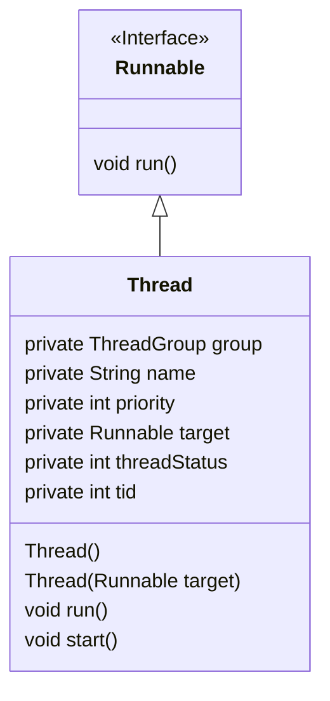

# Concurrency

## Basics

Process is a unit of execution, that has its own memory space - heap. The heap isn't shared between two applications or two processes, they each have their own. Each process can have multiple threads. Every application has at least one thread, and that's the main thread.

- Creating a thread doesn't require as many resources as creating a process does
- Every thread created by a process, shares that process's memory space, the heap
- Each thread's got what's called a thread stack. This is memory, that only a single thread, will have access to.

Every Java application runs as a single process, and each process can then have multiple threads within it. Every process has a heap, and every thread has a thread stack.

## Java's Threads

### `java.util.Thread`

#### Priority

Thread priority is a value from 1 to 10. The Thread class has three pre-defined priorities

- `Thread.MIN_PRIORITY = 1` - low
- `Thread.MIN_PRIORITY = 5` - default
- `Thread.MIN_PRIORITY = 10` - high

Higher-priority threads have a better chance of being scheduled, by a thread scheduler, over the lower-priority threads. We can think of the priority as more of a suggestion, to the thread management process.

### Ways to create a thread

- Extend the `Thread` class, and create an instance of this new subclass.
- Create a new instance of `Thread`, and pass it any instance that implements the `Runnable` interface.
- Use an Executor, to create one or more threads.

## Links

[An interesting aricle on mutlithreading in spring](https://www.stefankreidel.io/blog/spring-webmvc-servlet-threading)
