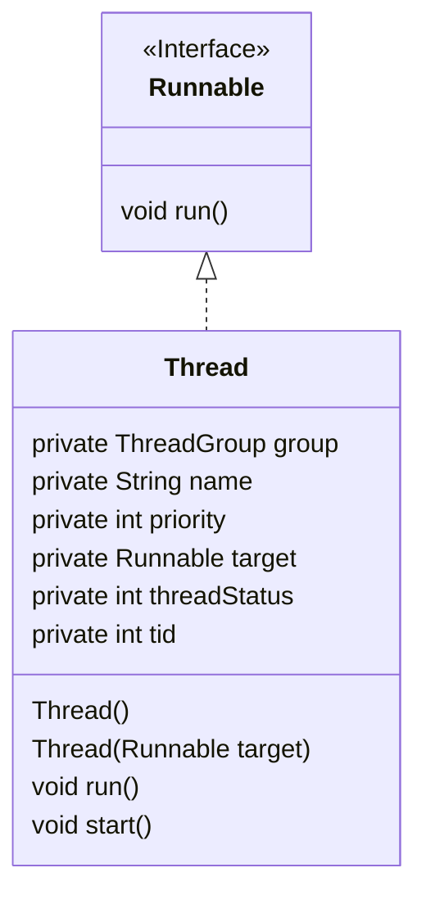
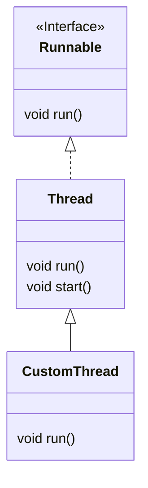
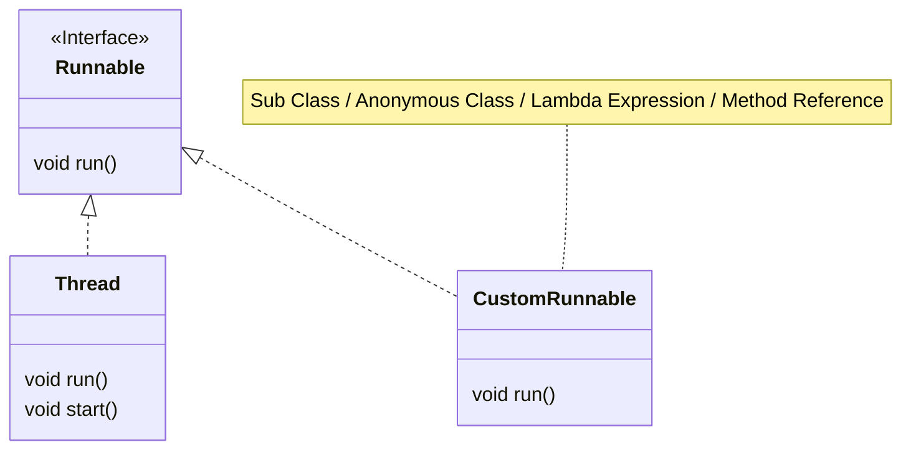

# Concurrency

## Basics

Process is a unit of execution, that has its own memory space - heap. The heap isn't shared between two applications or two processes, they each have their own. Each process can have multiple threads. Every application has at least one thread, and that's the main thread.

- Creating a thread doesn't require as many resources as creating a process does
- Every thread created by a process, shares that process's memory space, the heap
- Each thread's got what's called a thread stack. This is memory, that only a single thread, will have access to

Every Java application runs as a single process, and each process can then have multiple threads within it. Every process has a heap, and every thread has a thread stack.

## Java's Threads

### `java.util.Thread`



#### Priority

Thread priority is a value from 1 to 10. The Thread class has three pre-defined priorities

- `Thread.MIN_PRIORITY = 1` - low
- `Thread.MIN_PRIORITY = 5` - default
- `Thread.MIN_PRIORITY = 10` - high

Higher-priority threads have a better chance of being scheduled, by a thread scheduler, over the lower-priority threads. We can think of the priority as more of a suggestion, to the thread management process.

### Ways to create a thread

- Extend the `Thread` class, and create an instance of this new subclass
- Create a new instance of `Thread`, and pass it any instance that implements the `Runnable` interface
- Use an `Executor`, to create one or more threads

#### Extending the `Thread` class



Then we can do something like

```java
new CustomThread().start();
```

Advantages of extending a thread are

- We have more control over the thread's behavior and properties
- We can access the thread's methods and fields directly from our sub class
- We can create a new thread for each task

Disadvantages

- We can only extend one class in Java, so our subclass can't extend any other classes
- Our class is tightly coupled to the `Thread` class, which may make it difficult to maintain

#### Implementing `Runnable`



Then we can do something like

```java
new Thread(CustomRunnable).start();
```

Advantages of implementing a `Runnable`

- We can extend any class and still implement `Runnable`
- Our class (if we create a class) is loosely coupled to the `Thread` class, which makes it easier to maintain
- We can use anonymous classes, lambda expressions, or method references, to very quickly describe thread behavior

Disadvantages

- We do have less control over the thread's behavior and properties

### `run()` and `start()`

There's a big difference between calling `run()` and `start()`.

:::important
If we execute the `run90` method, it's executed _synchronously_, by the running thread it's invoked from. If we want our code to be run _asynchronously_, we must call the `native start()` method.
:::

### States

| Status        | Meaning                                                                                                              |
|---------------|----------------------------------------------------------------------------------------------------------------------|
| NEW           | A thread that has not yet started is in this state                                                                   |
| RUNNABLE      | A thread executing in the Java virtual machine is in this state                                                      |
| BLOCKED       | A thread that is blocked waiting for a monitor lock is in this state                                                 |
| WAITING       | A thread that is waiting indefinitely for another thread to perform a particular action is in this state             |
| TIMED_WAITING | A thread that is waiting for another thread to perform an action for up to a specified waiting time is in this state |
| TERMINATED    | A thread that has exited is in this state                                                                            |

## Links

[An interesting aricle on mutlithreading in Spring](https://www.stefankreidel.io/blog/spring-webmvc-servlet-threading)
