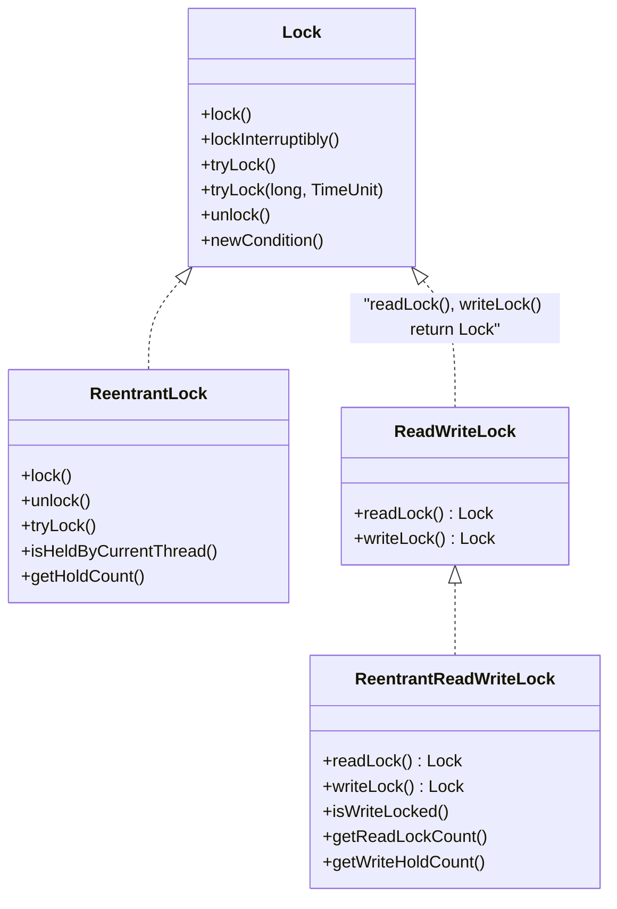

# Concurrency

## Basics

Process is a unit of execution, that has its own memory space - heap. The heap isn't shared between
two applications or two processes, they each have their own. Each process can have multiple threads.
Every application has at least one thread, and that's the main thread.

- Creating a thread doesn't require as many resources as creating a process does
- Every thread created by a process, shares that process's memory space, the heap
- Each thread's got what's called a thread stack. This is memory, that only a single thread, will
  have access to

Every Java application runs as a single process, and each process can then have multiple threads
within it. Every process has a heap, and every thread has a thread stack.

### Threads accessing memory

Each thread has its own stack for local variables and method calls. One thread doesn't have access
to another thread's stack. Every concurrent thread additionally has access to the process memory, or
the heap. This is where objects and their data reside. This shared memory space allows all threads,
to read and modify the same objects. When one thread changes an object on the heap, these changes
are visible to other threads.


### Time Slicing

It's a technique used in multitasking operating systems, to allow multiple threads or processes to
share a single CPU for execution. Available CPU time is sliced into small-time intervals, which are
divvied out to the threads. Each thread gets that interval, to attempt to make some progress, on the
tasks it has to do. Whether it completes its task or not, in that time slice, doesn't matter to the
thread management system. When the time is up, it has to yield to another thread, and wait until its
turn again.

### Interference

A thread can be halfway through its work, when it's time slice expires, and it then has to pause or
suspend execution, to allow other threads to wake up and execute. This means another active thread
has an open door, to that same unit of work, where the paused thread is only partially done.

### Interleaving

- When multiple threads run concurrently, their instructions can overlap or _interleave_ in time
- The execution of multiple threads happens in an arbitrary order
- The order in which the threads execute can't be guaranteed

### Atomic actions

An atomic action is one, that effectively happens all at once. It either happens completely, or it
doesn't happen at all. Side effects of an atomic action *are never visible until the action
completes*.

Even some assignment operators like for longs and doubles are not atomic. Some other examples are

`i++` - increment operand

`--i` - decrement operand

### Thread-Safe

An object or a block of code is thread safe, if the correctness and consistency of the program's
output or its visible state, is unaffected by other threads. Atomic operations and immutable objects
are examples of thread-safe code.

### [JMM](https://docs.oracle.com/javase/specs/jls/se7/html/jls-17.html#jls-17.4)

The Java Memory Model, is a specification that defines some rules and behaviors for threads, to help
control and manage shared access to data, and operations.

- Atomicity of Operations. Few operations are truly atomic.
- Synchronization is the process of controlling threads' access to shared resources.

## Java's Threads

### `java.util.Thread`


#### Priority

Thread priority is a value from 1 to 10. The Thread class has three pre-defined priorities

- `Thread.MIN_PRIORITY = 1` - low
- `Thread.MIN_PRIORITY = 5` - default
- `Thread.MIN_PRIORITY = 10` - high

Higher-priority threads have a better chance of being scheduled, by a thread scheduler, over the
lower-priority threads. We can think of the priority as more of a suggestion, to the thread
management process.

### Ways to create a thread

- Extend the `Thread` class, and create an instance of this new subclass
- Create a new instance of `Thread`, and pass it any instance that implements the `Runnable`
  interface
- Use an `Executor`, to create one or more threads

#### Extending the `Thread` class


Then we can do something like

```java
new CustomThread().start();
```

Advantages of extending a thread are

- We have more control over the thread's behavior and properties
- We can access the thread's methods and fields directly from our subclass
- We can create a new thread for each task

Disadvantages

- We can only extend one class in Java, so our subclass can't extend any other classes
- Our class is tightly coupled to the `Thread` class, which may make it difficult to maintain

#### Implementing `Runnable`


Then we can do something like

```java
new Thread(CustomRunnable).start();
```

Advantages of implementing a `Runnable`

- We can extend any class and still implement `Runnable`
- Our class (if we create a class) is loosely coupled to the `Thread` class, which makes it easier
  to maintain
- We can use anonymous classes, lambda expressions, or method references, to very quickly describe
  thread behavior

Disadvantages

- We do have less control over the thread's behavior and properties

### `run()` and `start()`

There's a big difference between calling `run()` and `start()`.

:::important
If we execute the `run()` method, it's executed _synchronously_, by the running thread it's invoked
from. If we want our code to be run _asynchronously_, we must call the `native start()` method.
:::

### States

| Status          | Meaning                                                                                                              |
|-----------------|----------------------------------------------------------------------------------------------------------------------|
| `NEW`           | A thread that has not yet started is in this state                                                                   |
| `RUNNABLE`      | A thread executing in the Java virtual machine is in this state                                                      |
| `BLOCKED`       | A thread that is blocked waiting for a monitor lock is in this state                                                 |
| `WAITING`       | A thread that is waiting indefinitely for another thread to perform a particular action is in this state             |
| `TIMED_WAITING` | A thread that is waiting for another thread to perform an action for up to a specified waiting time is in this state |
| `TERMINATED`    | A thread that has exited is in this state                                                                            |

## `volatile`

The operating system may read from heap variables, and make a copy of the value, in each thread's
own storage cache. Each thread has its own small and fast memory storage, that holds its own copy of
a shared resource's value. One thread can modify a shared variable, but this change might not be
immediately reflected or visible. Instead, it's first updated in the thread's local cache. The
operating system may not flush the first thread's changes to the heap, until the thread has finished
executing.

The `volatile` keyword is used as a modifier for class variables. It's an indicator that this
variable's value may be changed by multiple threads. This modifier ensures that the variable is
always read from, and written to the main memory, rather than from any thread-specific caches. This
provides memory consistency for this variable's value across threads.

### When to use

- When a variable is used to track the state of a shared resource, such as a counter or a flag
- When a variable is used to communicate between threads

### When not to use

- When a variable is only used by a single thread 
- When a variable is used to store a large amount of data

## `synchronized`

Different invocations of `synchronized` methods, on the same object, are guaranteed not to
interleave. When one thread is executing a `synchronized` method for an object, all other threads
that invoke `synchronized` methods for the same object, block, and suspend their execution, until
the first thread is done with the object. When a `synchronized` method exits, it ensures that the
state of the object is visible to all threads.

```java
public synchronized void instanceMethod() {
    // Locks on 'this'
}

public static synchronized void staticMethod() {
    // Locks on Class object (MyClass.class)
}
```

### Critical Section

The critical section is the code that's referencing a shared resource like a variable. Only one
thread at a time should be able to execute a critical section. When all critical sections are
synchronized, the class is thread-safe.

### Object instance monitor

Every object instance in Java has a space for a built-in intrinsic lock, also known as a monitor
lock. A thread acquires a lock by executing a synchronized method on the instance, or by using the
instance as the parameter to a synchronized statement. A thread releases a lock when it exits from a
synchronized block or method, even if it throws an exception. Only one thread at a time can acquire
this lock, which prevents all other threads from accessing the instance's state, until the lock is
released. All other threads, which want access to the instance's state through synchronized code,
will block, and wait, until they can acquire a lock.

### Statement

The synchronized statement is usually a better option in most circumstances, since it limits the
scope of synchronization, to the critical section of code. It gives us much more granular control,
over when we want other threads to block.

```java
public void doSomething() {
    synchronized(this) {
        // Critical section — only one thread at a time per instance
    }

    synchronized(SomeClass.class) {
        // Critical section — one thread across all instances
    }

    synchronized(someOtherObject) {
        // We can lock on any object we choose
    }
}
```

Using synchronized statement on specific object or a class property lets other threads work faster
with the instance, the statement is located in. This is because we are not locking the whole object
which might be a singleton service, but only the data that must stay synced or.

### Reentrant Synchronization

When method calls are executed from the same thread, any nested calls which try to acquire
the lock, won't block, because the current thread already has it. Without this, threads could block
indefinitely.

### [`wait()`](https://docs.oracle.com/javase/8/docs/api/java/lang/Object.html#wait-long-), [`notify()`](https://docs.oracle.com/javase/8/docs/api/java/lang/Object.html#notify--), [`notifyAll()`](https://docs.oracle.com/javase/8/docs/api/java/lang/Object.html#notifyAll--)

Are used to manage some monitor lock situations, to prevent threads from blocking indefinitely.
Because these methods are on `Object`, any instance of any class, can execute these methods, from
within a `synchronized` method or statement.

There are a few pieces of docs that are important here

1. A _spurious wakeup_ might happen, so a thread might wake up without being notified, interrupted,
   or timing out, so `wait()` must be used in a loop of some kind like

```java
synchronized (obj) {
         while (<condition does not hold>)
             obj.wait(timeout);
         ... // Perform action appropriate to condition
     }
```

2. There are three ways of a thread becoming the owner of the object's monitor

- By executing a `synchronized` instance method of that object
- By executing the body of a `synchronized` statement that synchronizes on the object
- For objects of type Class, by executing a `synchronized` static method of that class

## Locks

The purpose of a lock is to control access to a shared resource by multiple threads. The monitor
lock is pretty easy to use, but it does have limitations.

- There's no way to test if the intrinsic lock has already been acquired
- There's no way to interrupt a blocked thread
- There's not an easy way to debug, or examine the intrinsic lock
- The intrinsic lock is an exclusive lock

### `java.util.concurrent.locks`

The `Lock` Interface, and some of the provided implementations, can give us a bit more control, and
flexibility over locking, and when and how to block threads.

- [`ReentrantLock`](https://docs.oracle.com/en/java/javase/17/docs/api/java.base/java/util/concurrent/locks/ReentrantLock.html)
- [`ReentrantReadWriteLock`](https://docs.oracle.com/en/java/javase/17/docs/api/java.base/java/util/concurrent/locks/ReentrantReadWriteLock.html)



#### `ReentrantLock`

- Explicit locking (`lock()` and `unlock()`)
- Reentrancy: same thread can lock multiple times
- `tryLock()`: non-blocking attempt to acquire a lock
- `lockInterruptibly()`: allows interruption
- Fairness is possible: queue threads in order of arrival

```java
new ReentrantLock(true);
```

#### `ReentrantReadWriteLock`

`ReentrantReadWriteLock`s can be used to improve concurrency in some uses of some kinds of
`Collection`s. This is typically worthwhile only when the collections are expected to be large,
accessed by more reader threads than writer threads, and entail operations with overhead that
outweighs synchronization overhead.

- Multiple readers at the same time
- Only one writer, and no readers during writing

```java
ReadWriteLock rwLock = new ReentrantReadWriteLock();
Lock readLock = rwLock.readLock();
Lock writeLock = rwLock.writeLock();
```

## Links

[An interesting aricle on mutlithreading in Spring](https://www.stefankreidel.io/blog/spring-webmvc-servlet-threading)
