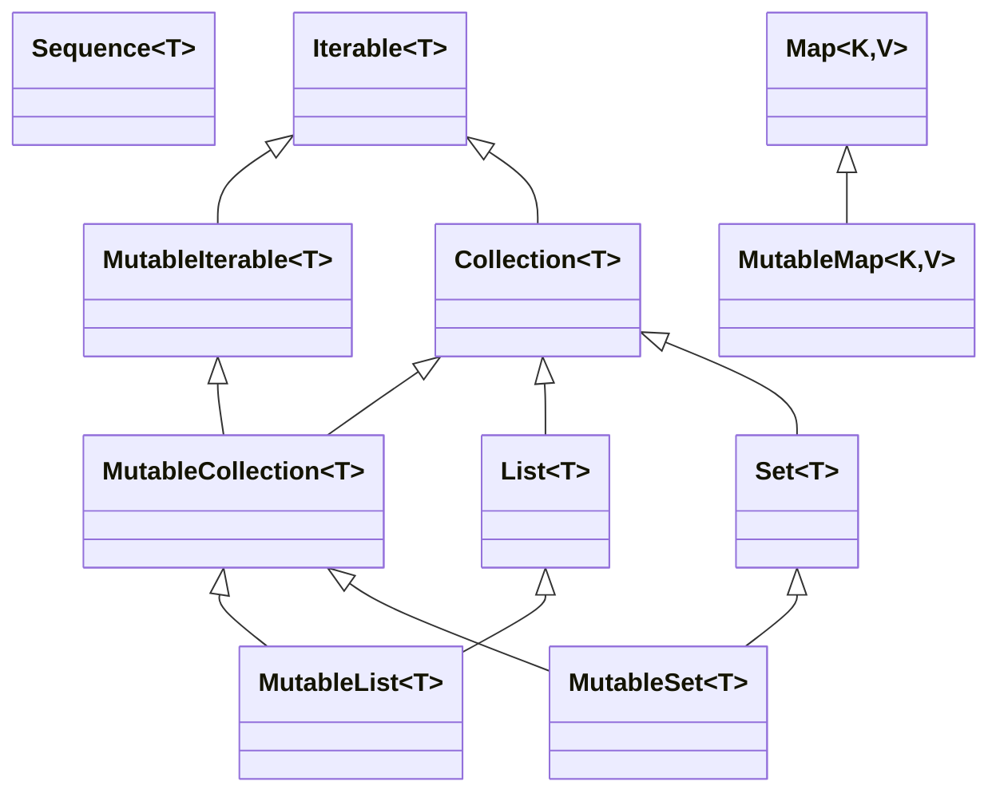

# Collections and Sequences

As a rule of thumb - we better use sequences when there are multiple chained calls to avoid creating multiple collections.
At the same time it might be possible to use collections when the logic allows to put multiple operation in one call like `mapNotNull()`.



## Collections

All collections functions are inlined, so there is no performance overhead from that side, but intermediate
collections are created for chained calls.

```kotlin
val list = listOf(1, 2, 3)
val maxOddSquare = list
    .map { it * it }
    .filter { it % 2 == 1 }
    .max()
```

Results in 3 collections being created.

## Sequences

Sequences are very alike to java streams. Actually they are called sequences just because the name "streams"
has already been taken. Sequences provide lazy evaluation compared to collections, that utilize eager execution.

The same example from above will look like

```kotlin
val list = listOf(1, 2, 3)
val maxOddSquare = list
    .asSequence()
    .map { it * it }
    .filter { it % 2 == 1 }
    .max()
```

To generate a sequence

```kotlin
import kotlin.random.Random

val seq = generateSequence { 
    Random.nextInt(5).takeIf { it > 0 }    
}
println(seq.toList())
```

At the same time lambdas in sequences are not inlined.
