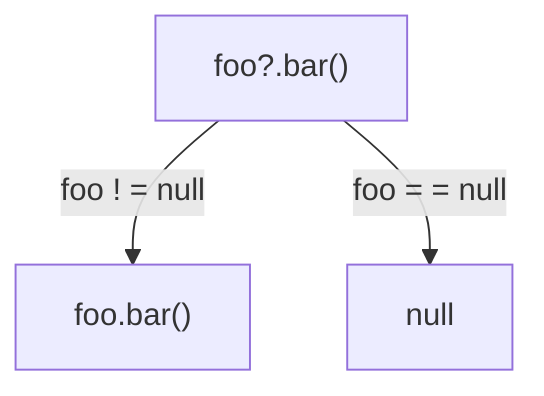
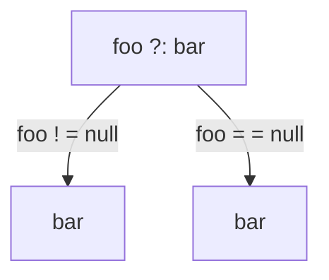
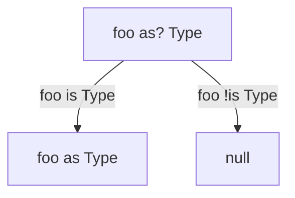

# Nullability

Kotlin took the approach of making NPE a compile-time exception. Each type is a child of the same nullable type. Under
the hood `fun foo(): String? = "foo"` is

```java

@Nullable
public static final String foo() {
    return "foo";
}
```

`fun bar(): String = "bar"` is

```java

@NotNull
public static final String foo() {
    return "foo";
}
```

Operators to work with nullability in Kotlin

`!!`

`s!!` - throws NPE if `s` is null

`?.`



`?:`



`as?`



### Generics

A regular generic argument (`T` for example) can receive a nullable type. We can make it explicit.

```kotlin
fun <T> List<T>.firstOrNull(): T? {}
```

At the same time we can set a non-nullable upper bound with `Any`.

```kotlin
fun <T : Any> foo(list: List<T>) {
    for (element in list) {
        
    }
}
```

If we need to use multiple constraints for a type parameter we must use the `where`.

```kotlin
fun <T> ensureTrailingPeriod(seq: T) where T : CharSequence, T : Appendable {
    if (!seq.endsWith('.')) {
        seq.append('.')
    }
}
```

In situations when generics result in the same JVM signature we must use `@JvmName` to resolve the conflict.

```kotlin
fun List<Int>.average(): Duble { }
@JvmName("averageOfDouble")
fun List<Double>.average(): Double { }
```
