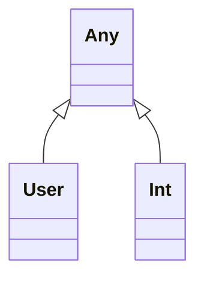
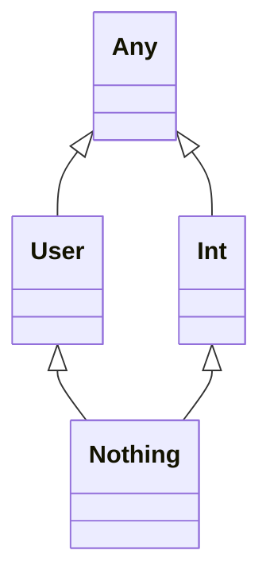
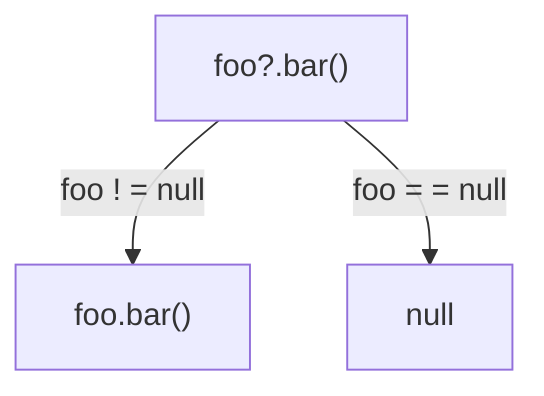
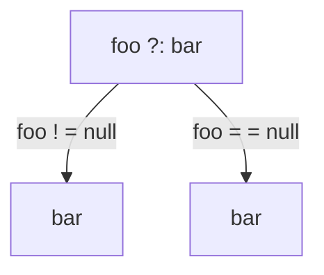
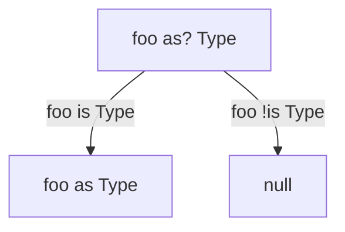
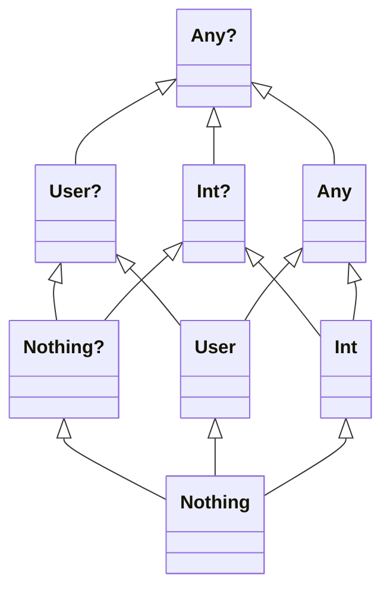

# Types under the hood

There are no primitive types in Kotlin. Correspondence between Kotlin and Java types would look like

Kotlin

```kotlin
fun foo(): Int = 1
```

Decompiled Java code

```java
public static final int foo() {
    return 1;
}
```

Kotlin 

```kotlin
fun bar(): Int? = 1
```

Decompiled Java code

```java
public static final Integer bar() {
    return 1;
}
```

## Kotlin vs Java bytecode types

| Kotlin              | Java                                            |
|---------------------|-------------------------------------------------|
| `Int`               | `int`                                           |
| `Double`            | `double`                                        |
| `Boolean`           | `boolean`                                       |
| `Int?`              | `java.lang.Integer`                             |
| `Double?`           | `java.lang.Double`                              |
| `Boolean?`          | `java.lang.Boolean`                             |
| `Array<Int>`        | `Integer[]`                                     |
| `IntArray`          | `int[]`                                         |
| `List<Int>`         | `List<Integer>`                                 |
| `kotlin.String`     | `java.lang.String`                              |
| `Any`               | `java.lang.Object`                              |
| `() -> Boolean`     | `kotlin.jvm.functions.Function0<Boolean>`       |
| `(Order) -> Int`    | `kotlin.jvm.functions.Function1<Order, Int>`    |
| `(Int, Int) -> Int` | `kotlin.jvm.functions.Function2<Int, Int, Int>` |
| `Unit`              | `void`                                          |
| `Nothing`           | `void`                                          |

## `Any`

In Kotlin `Any` is not only a super type for all reference types, but it's also a super types for
types like `Int`, corresponding to primitives.



## `Nothing`

`Nothing` is a subtype of all the other types. Having `Nothing` type in the language really helps
with type inference in branch logic situations.



### `Unit` vs `Nothing` vs `void`

1. `Unit` instead of `void` - no meaningful value is returned

```kotlin
// those are equivalent syntatic forms
fun f() {}
fun f(): Unit {}
```

2. `Nothing` means 'this function never returns'

```kotlin
fun fail(message: String): Nothing {
    throw IllegalStateException(message)
}
```

# Nullability

Kotlin took the approach of making NPE a compile-time exception. Each type is a child of the same
nullable type. Under the hood `fun foo(): String? = "foo"` is

```java

@Nullable
public static final String foo() {
    return "foo";
}
```

`fun bar(): String = "bar"` is

```java

@NotNull
public static final String foo() {
    return "foo";
}
```

Operators to work with nullability in Kotlin

`!!`

`s!!` - throws NPE if `s` is null

`?.`



`?:`



`as?`



## Types

All nullable types are super types for non-nullable types because we want to be able to assign a
`User` to `User?` but not vice versa. The simplest example of `Nothing?` though is `null`.



## Platform type

`Type!` notation is used for types that came from Java, it's the type for "unknown" nullability. To
avoid possible NPE here it's useful to

- Annotate Java types
- Specify types explicitly

# Generics

A regular generic argument (`T` for example) can receive a nullable type. We can make it explicit.

```kotlin
fun <T> List<T>.firstOrNull(): T? {}
```

At the same time we can set a non-nullable upper bound with `Any`.

```kotlin
fun <T : Any> foo(list: List<T>) {
    for (element in list) {
        
    }
}
```

If we need to use multiple constraints for a type parameter we must use the `where`.

```kotlin
fun <T> ensureTrailingPeriod(seq: T) where T : CharSequence, T : Appendable {
    if (!seq.endsWith('.')) {
        seq.append('.')
    }
}
```

In situations when generics result in the same JVM signature we must use `@JvmName` to resolve the
conflict.

```kotlin
fun List<Int>.average(): Duble { }
@JvmName("averageOfDouble")
fun List<Double>.average(): Double { }
```
