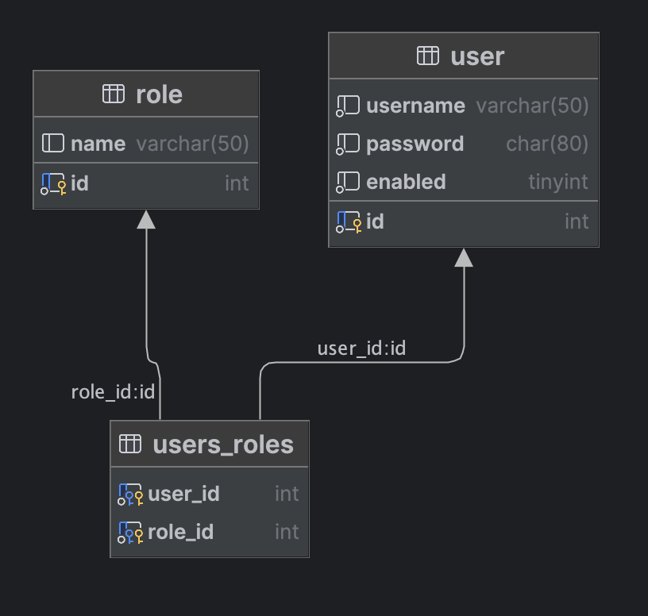

# Security

* Implemented using Servlet filters in the background
* Two methods of securing an app: declarative and programmatic

### Declarative Security

* Define application’s security constraints in configuration
* All Java config: @Configuration
* Provides separation of concerns between application code and security

### Programmatic Security

* Spring Security provides an API for custom application coding
* Provides greater customization for specific app requirements

## Spring Security with Servlet Filters

* Servlet Filters are used to pre-process / post-process web requests
* Servlet Filters can route web requests based on security logic
* Spring provides a bulk of security functionality with servlet filters

## Security Concepts

*Authentication*

* Check user id and password with credentials stored in app / db

*Authorization*

* Check to see if user has an authorized role

## Enabling Spring Security

* Will automatically secure all endpoints

```xml

<dependency>
  <groupId>org.springframework.boot</groupId>
  <artifactId>spring-boot-starter-security</artifactId>
</dependency>
```

* Override default username / password

```properties
spring.security.user.name=scott
spring.security.user.password=test123
```

## Configuring Basic Security

* Create configuration

```java
import org.springframework.context.annotation.Configuration;

@Configuration
public class SecurityConfiguration {
    // ...
}
```

* We can create in-memory users

```java

@Configuration
public class SecurityConfiguration {

    @Bean
    public InMemoryUserDetailsManager userDetailsManager() {
        UserDetails john = User.builder()
            .username("john")
            .password("{noop}test123")
            .roles("EMPLOYEE")
            .build();
        return new InMemoryUserDetailsManager(john, mary, susan);
    }
}
```

Password data encryption ids:

* `{noop}` - plain text :(
* `{bcrypt}`

* We can restrict access based on role

```java
public SecurityFilterChain filterChain(HttpSecurity http) throws Exception {
    http.authorizeHttpRequests(configurer ->
        configurer
            .requestMatchers(HttpMethod.GET, "/api/employees").hasRole("EMPLOYEE")
            .requestMatchers(HttpMethod.GET, "/api/employees/**").hasRole("EMPLOYEE")
            .requestMatchers(HttpMethod.POST, "/api/employees").hasRole("MANAGER")
            .requestMatchers(HttpMethod.PUT, "/api/employees").hasRole("MANAGER")
            .requestMatchers(HttpMethod.DELETE, "/api/employees/**").hasRole("ADMIN"));
    // use HTTP Basic authentication
    http.httpBasic(Customizer.withDefaults());
    return http.build();
}
```

## Read / write user account from / info database

* Following Spring Security’s predefined table schemas



:::caution
Password column must be at least 68 chars wide

* `{bcrypt}` - 8 chars
* encodedPassword - 60 chars

:::

* Basic custom
  setup [example](https://github.com/daverbk/spring/tree/main/05-spring-rest-security/02-spring-boot-rest-security-jpa)

```java

@Configuration
public class SecurityConfiguration {

    @Bean
    public BCryptPasswordEncoder passwordEncoder() {
        return new BCryptPasswordEncoder();
    }

    @Bean
    public DaoAuthenticationProvider authenticationProvider(UserService userService) {
        DaoAuthenticationProvider auth = new DaoAuthenticationProvider();
        auth.setUserDetailsService(userService);
        auth.setPasswordEncoder(passwordEncoder());
        return auth;
    }

    @Bean
    public SecurityFilterChain filterChain(HttpSecurity http) throws Exception {

        http.authorizeHttpRequests(configurer ->
            configurer
                .requestMatchers(HttpMethod.GET, "/api/employees").hasRole("EMPLOYEE")
                .requestMatchers(HttpMethod.GET, "/api/employees/**").hasRole("EMPLOYEE")
                .requestMatchers(HttpMethod.POST, "/api/employees").hasRole("MANAGER")
                .requestMatchers(HttpMethod.PUT, "/api/employees").hasRole("MANAGER")
                .requestMatchers(HttpMethod.DELETE, "/api/employees/**").hasRole("ADMIN"));

        http.httpBasic();

        http.csrf().disable();

        return http.build();
    }
}
```
