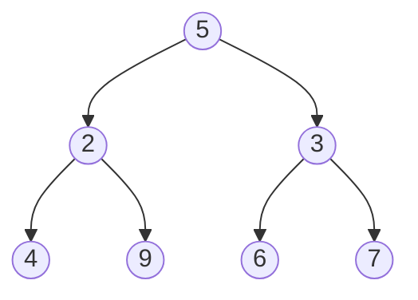

# Trees

## Operations complexity

### Binary Trees

| Operation       | Time Complexity | Space Complexity                                                                                  |
| --------------- | --------------- | ------------------------------------------------------------------------------------------------- |
| `dfs traversal` | `O(n)`          | `O(n)` when the tree is just a straight line, optimistically `O(log n)` if the tree is "complete" |
| `bfs traversal` | `O(n)`          | `O(n)`                                                                                            |

## Terminology

The **root** node is the node at the "top" of the tree, the **root** is the only node that has no parent. In a tree, a node cannot have more than one parent. In a binary tree, all nodes have a maximum of two **children**. These children are referred to as the left child and the right child.

If we have a node `A` with an edge to a node `B`, so `A` -> `B`, we call `A` the parent of node `B`, and node `B` a child of node `A`.

If a node has no children, it is called a **leaf** node. The **leaf** nodes are the **leaves** of the tree.

The depth of a node is how far it is from the root node. The root has a depth of 0. Every child has a depth of `parentsDepth + 1`.

:::note

A "complete" binary tree is one where every level (except possibly the last) is full, and all the nodes in the last level are as left as possible.

:::

A **subtree** of a tree is a node and all its descendants.



## In Code

```java
class TreeNode {
    int val;
    TreeNode left;
    TreeNode right;
    TreeNode (int val) {
        this.val = val;
    }
}
```

## Depth-First Search

You can think of the paths of a binary tree as branches growing from the root. DFS chooses a branch and goes as far down as possible. Once it fully explores the branch, it backtracks until it finds another unexplored branch.

Typical dfs goes like this:

1. Handle the base case(s). Usually, an empty tree (node = null) is a base case.
2. Do some logic for the current node
3. Recursively call on the current node's children
4. Return the answer

Each function call solves and returns the answer to the original problem as if the subtree rooted at the current node was the input.

### Types of DFS

1. Preorder traversal

In **preorder** traversal, logic is done on the current node before moving to the children. In that case, at any given node, we would print the current node's value, then recursively call the left child, then recursively call the right child.

```java
public void preorderDfs(Node node) {
    if (node == null) {
        return;
    }

    System.out.println(node.val); // the logic
    preorderDfs(node.left);
    preorderDfs(node.right);
    return;
}
```

2.Inorder traversal

For **inorder** traversal, we first recursively call the left child, then perform logic (print in this case) on the current node, and then recursively call the right child.

```java
public void inorderDfs(Node node) {
    if (node == null) {
        return;
    }

    inorderDfs(node.left);
    System.out.println(node.val);
    inorderDfs(node.right);
    return;
}
```

3. Postorder traversal

In **postorder** traversal, we recursively call on the children first and then perform logic on the current node. This means no logic will be done until we reach a leaf node since calling on the children takes priority over performing logic. In a **postorder** traversal, the root is the last node where logic is done.

```java
public void postorderDfs(Node node) {
    if (node == null) {
        return;
    }

    postorderDfs(node.left);
    postorderDfs(node.right);
    System.out.println(node.val);
    return;
}
```

### Iterative implementation

```java
class Solution {
    public int maxDepth(TreeNode root) {
        if (root == null) {
            return;
        }

        Stack<TreeNode> stack = new Stack<>();
        stack.push(root);

        while (!stack.empty()) {
            TreeNode node = stack.pop();
            System.out.println(node.val)

            if (node.left != null) {
                stack.push(node.left);
            }
            if (node.right != null) {
                stack.push(node.right);
            }
        }

        return;
    }
}
```

We are adding `node.left` before `node.right`. Popping from a stack removes the most recently added element, thus we are actually visiting the right subtree first.

## Breadth-First Search

In BFS, we traverse all nodes at a given depth before moving on to the next depth. BFS is implemented iteratively with a queue.

```java
public void printAllNodes(TreeNode root) {
    Queue<TreeNode> queue = new LinkedList<>();
    queue.add(root);

    while (!queue.isEmpty()) {
        int nodesInCurrentLevel = queue.size();
        // do some logic here for the current level

        for (int i = 0; i < nodesInCurrentLevel; i++) {
            TreeNode node = queue.remove();

            // do some logic here on the current node
            System.out.println(node.val);

            // put the next level onto the queue
            if (node.left != null) {
                queue.add(node.left);
            }
            if (node.right != null) {
                queue.add(node.right);
            }
        }
    }
}
```

## DFS vs BFS

In terms of binary tree algorithm problems, it is very rare to find a problem that using DFS is "better" than using BFS. However, implementing DFS is usually quicker because it requires less code, and is easier to implement using recursion, so for problems where BFS/DFS doesn't matter, most people end up using DFS.

On the flip side, there are quite a few problems where using BFS makes way more sense algorithmically than using DFS. Usually, this applies to any problem where we want to handle the nodes according to their level.

The main disadvantage of DFS is that you could end up wasting a lot of time looking for a value. Let's say that you had a huge tree, and you were looking for a value that is stored in the root's right child. If you do DFS prioritizing left before right, then you will search the entire left subtree, which could be hundreds of thousands if not millions of operations. Meanwhile, the node is literally one operation away from the root.

The main disadvantage of BFS is that if the node you're searching for is near the bottom, then you will waste a lot of time searching through all the levels to reach the bottom.

In terms of space complexity, DFS uses space linear with the height of the tree (the maximum depth), whereas BFS uses space linear with the level that has the most nodes. In some cases, DFS will use less space, in other cases, BFS will use less.
