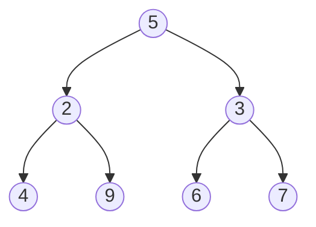

# Trees

## Operations complexity

| Operation   | Complexity |
| ----------- | ---------- |
| `traversal` | `O(1)`     |

# Terminology

The root node is the node at the "top" of the tree, the **root** is the only node that has no parent. In a tree, a node cannot have more than one parent. In a binary tree, all nodes have a maximum of two children. These children are referred to as the left child and the right child.

If we have a node `A` with an edge to a node `B`, so `A` -> `B`, we call `A` the parent of node `B`, and node `B` a child of node `A`.

If a node has no children, it is called a **leaf** node. The leaf nodes are the **leaves** of the tree.

The depth of a node is how far it is from the root node. The root has a depth of 0. Every child has a depth of `parentsDepth + 1`.

